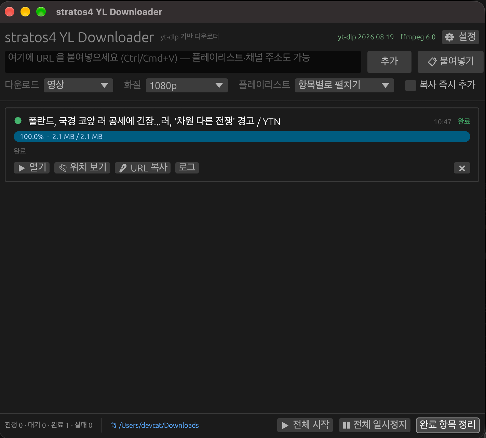
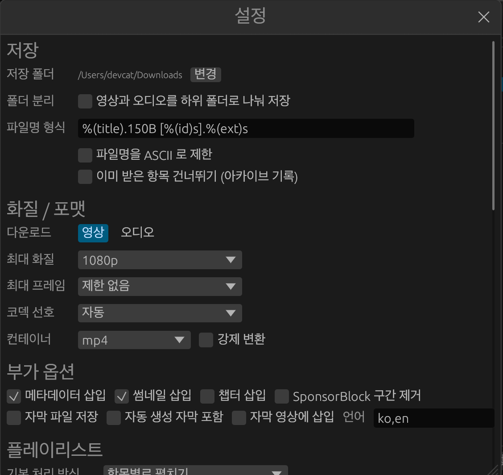

# stratos4 YT Downloader

*한국어 · [English](README.en.md)*

yt-dlp 기반 크로스플랫폼(macOS / Windows) 다운로드 앱. Rust + egui 로 작성했고,
외부 런타임 없이 단일 실행 파일로 동작한다.

## 화면

| 메인 창 | 설정 |
|---------|------|
|  |  |

URL 을 붙여넣으면 바로 대기열에 들어가고, 상단 바에서 다운로드 종류·화질·플레이리스트 처리를
설정 창을 열지 않고 바꿀 수 있다.


## 특징

- **붙여넣기 다운로드** — 창에서 `Ctrl/Cmd+V` 를 누르면 클립보드의 URL 이 즉시 대기열에 들어간다.
  URL 이 여러 개 들어 있으면 모두 추가한다. URL 이 담긴 텍스트 파일을 끌어다 놓아도 된다.
- **플레이리스트 / 채널** — 목록 주소를 그대로 붙여넣을 수 있다. 처리 방식은 세 가지.
  - `항목별로 펼치기`(기본) — 목록을 읽어 항목마다 개별 작업을 만든다. 항목별 진행률·재시도·동시 다운로드가 가능하다.
  - `한 작업으로 일괄` — yt-dlp 가 목록 전체를 순서대로 처리한다.
  - `이 영상만` — `list=` 파라미터를 무시하고 해당 영상만 받는다.
- **빠른 설정** — 설정 창을 열지 않고 상단에서 `다운로드(영상/오디오)`, `화질`, `플레이리스트 처리`를 바꾼다.
- **yt-dlp / ffmpeg 자동 관리** — 시작할 때 설치 여부와 최신 버전을 확인하고,
  없으면 내려받고 새 버전이 나오면 자동으로 적용한다. 시스템에 아무것도 설치하지 않아도 된다.
- **다국어 UI** — 영어 · 일본어 · 한국어 · 중국어(간체) · 아랍어 · 독일어 · 프랑스어 · 스페인어 · 포르투갈어.
  기본값은 OS 표시 언어를 따르고, `설정 → 언어` 에서 바꾸면 즉시 반영된다.
  선택한 언어의 문자에 맞춰 시스템 폰트를 자동으로 얹는다.
- **일시정지 / 이어받기** — 일시정지는 부분 파일을 남기므로 다시 시작하면 이어서 받는다.
- 동시 다운로드 수, 조각 동시 전송, 속도 제한, 프록시, 브라우저 쿠키, SponsorBlock,
  자막, 썸네일·메타데이터 삽입, 파일명 템플릿, 영상/오디오 폴더 분리 저장 등을 설정할 수 있다.

## 버전별 상황

- **1.1** — 9개 언어 UI 추가 (영어 / 일본어 / 한국어 / 중국어 / 아랍어 / 독일어 / 프랑스어 / 스페인어 / 포르투갈어)
- **1.0** — 다운로드 되는것 확인


## 빌드

Rust 1.85 이상이 필요하다. 모든 작업은 `make` 로 자동화돼 있다.

```bash
make                  # 개발 빌드 후 실행
make build            # 릴리스 빌드 → target/release/stratos-dl
make mac              # macOS .app + zip (현재 아키텍처)
make mac-universal    # Intel + Apple Silicon 통합 .app + zip
make win              # Windows .exe + zip (크로스 툴체인 필요)
make dist             # 가능한 모든 플랫폼 패키징
make check            # fmt + clippy(-D warnings) + 릴리스 빌드
make icons            # img/icon.png → .icns / .ico 재생성
make status / tools   # yt-dlp·ffmpeg 상태 확인 / 최신판 설치
make clean            # target/ 과 dist/ 정리
```

결과물은 `dist/` 에 `stratos-dl-<버전>-<플랫폼>.zip` 형태로 놓인다.
macOS 앱은 자동으로 ad-hoc 서명된다. 정식 인증서가 있으면
`CODESIGN_ID="Developer ID Application: ..." make mac` 처럼 지정한다.

### 아이콘

`img/icon.png` 한 장이 원본이다. 바꾼 뒤 아이콘을 다시 만든다.

```bash
make icons        # → img/AppIcon.icns (macOS), img/icon.ico (Windows)
```

생성 결과는 저장소에 커밋한다. CI 러너는 이 스크립트를 돌리지 않고 커밋된 파일을 쓴다.

| 자리 | 출처 |
|------|------|
| 창 / 작업표시줄 | `img/icon.png` 를 실행 파일에 포함 (`include_bytes!`) |
| macOS Dock·Finder | `.app` 번들의 `AppIcon.icns` |
| Windows 탐색기 | `build.rs` 가 `icon.ico` 를 `.exe` 리소스로 삽입 |

원본이 1024px 미만이면 큰 크기가 확대되어 흐려진다. `make icons` 가 경고로 알려준다.
Windows 리소스 삽입에는 `rc.exe`(MSVC) 또는 `windres`(mingw)가 필요하다.
없으면 아이콘만 빠지고 빌드는 계속된다.

### macOS 에서 Windows 실행 파일 만들기

크로스 빌드 툴체인을 한 번만 설치하면 `make win` 이 동작한다.

```bash
./scripts/setup-cross.sh          # cargo-xwin (MSVC ABI, CI 결과물과 동일)
./scripts/setup-cross.sh mingw    # mingw-w64 (GNU ABI)
```

설치돼 있지 않으면 `make win` 이 설치 방법을 안내하고 종료한다.
Windows 릴리스 빌드는 콘솔 창 없이 실행된다(`windows_subsystem = "windows"`).

### CI

`.github/workflows/build.yml` 이 세 단계로 동작한다.

1. **check** — `cargo fmt --check` 와 `clippy -D warnings`
2. **build** — macOS 통합(Intel + Apple Silicon) / Windows x64 를 병렬 빌드해 아티팩트 업로드
3. **release** — `v*` 태그를 푸시하면 GitHub Release 를 만들고 zip 과 `.exe` 를 첨부

```bash
git tag v0.1.0 && git push origin v0.1.0   # → 릴리스 자동 생성
```

## 외부 도구

| 도구 | 역할 | 기본 동작 |
|------|------|-----------|
| yt-dlp | 실제 다운로드 | 앱이 [yt-dlp 릴리스](https://github.com/yt-dlp/yt-dlp/releases)에서 단독 실행 파일을 받아 관리 |
| ffmpeg / ffprobe | 영상·오디오 병합, 오디오 변환, 썸네일·메타데이터 삽입 | 없으면 [정적 빌드](https://github.com/eugeneware/ffmpeg-static)를 자동 설치 |

두 도구는 아래 경로에 설치되며, 설치한 릴리스 태그를 `installed.json` 에 기록해 최신 여부를 판단한다.
(실행 파일이 보고하는 버전과 릴리스 태그가 어긋나는 배포본이 있어 태그를 기준으로 삼는다.)

- macOS: `~/Library/Application Support/dev.stratos.stratos-dl/bin`
- Windows: `%APPDATA%\stratos\stratos-dl\data\bin`

시스템에 이미 설치된 yt-dlp 를 쓰려면 설정 → 도구에서 `시스템 설치본` 을 선택한다.
ffmpeg 은 파일 존재 여부가 아니라 `-version` 실행 성공 여부로 판단하므로,
설치돼 있지만 라이브러리가 깨져 실행되지 않는 경우도 걸러낸다.

## 설정 파일

- macOS: `~/Library/Application Support/dev.stratos.stratos-dl/settings.json`
- Windows: `%APPDATA%\stratos\stratos-dl\data\settings.json`

## 보조 CLI

GUI 없이 상태 확인과 설치가 가능하다. 문제 해결이나 CI 에서 쓴다.

```bash
stratos-dl --check-tools            # yt-dlp / ffmpeg 설치 상태와 최신 태그
stratos-dl --install-tools          # 최신판을 앱 폴더에 설치
stratos-dl --download <URL>...      # 저장된 설정 그대로 헤드리스 다운로드
```

## 구조

| 파일 | 역할 |
|------|------|
| `src/main.rs` | 진입점, 보조 CLI |
| `src/app.rs` | egui UI (상단 바, 대기열, 설정 창) |
| `src/engine.rs` | 대기열 스케줄러, yt-dlp 프로세스 실행, 진행률 파싱, 플레이리스트 해석 |
| `src/config.rs` | 설정 영속화, yt-dlp 인자 생성 |
| `src/tools.rs` | yt-dlp / ffmpeg 탐색·설치·업데이트 |
| `src/util.rs` | URL 추출, 포맷터, 한글 폰트 주입, 실행파일 탐색 |
| `Makefile` / `scripts/build.sh` | 빌드·패키징 자동화 |
| `scripts/setup-cross.sh` | macOS → Windows 크로스 빌드 툴체인 설치 |
| `build.rs` | Windows `.exe` 에 아이콘·버전 정보 삽입 |
| `scripts/make-icons.sh` | `icon.png` → `.icns` / `.ico` 생성 |
| `img/` | 아이콘 원본과 생성물 |
| `.github/workflows/build.yml` | CI: 린트 → 3개 플랫폼 빌드 → 태그 시 릴리스 |
| `.vscode/` | VS Code 태스크(⇧⌘B), 디버그 구성(F5), 추천 확장 |
